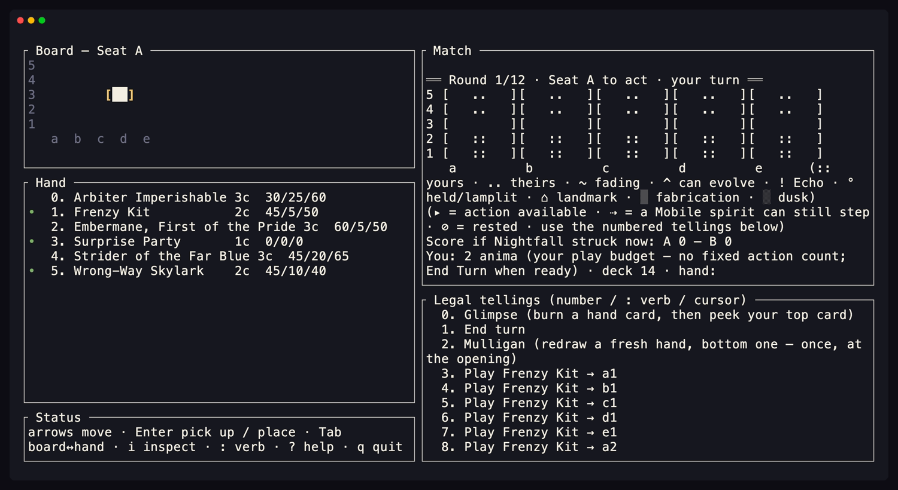

# Gallery — Recollect's committed media record (signature-tier)

A committed **media record** of every face of Recollect, split into two registers that mirror
the two clients, each in its own subdirectory so the layout is symmetric and each gallery dir
holds **only generated files**:

```
docs/gallery/
├── README.md      ← this index (the ONLY hand-authored file here)
├── web/           ← the WEB register — generated only
│   ├── shell-*, placed-*, inspect-*, special-*, board-2v2-*, shell-online-*,
│   │              glimpse-*, mulligan-*   (canvas stills — CPU rasterizer)
│   ├── site-*     (static-site page stills — Playwright, headless)
│   └── clip-*     (canvas motion clips — Playwright, real GPU)
└── tui/           ← the TERMINAL register — generated only
    ├── tui-*.txt, cursor-*.txt   (the byte-for-byte .txt goldens — a make-test gate)
    └── shot-*.png, cursor.gif    (real terminal screenshots + a clip — committed artifact)
```

Each register is regenerated by its own tool; this README is the index over both. The
design-of-record for the web client is [`docs/decisions/web_client_ux.md`](../decisions/web_client_ux.md);
the brand palette + the WCAG-AA bar are
[`docs/decisions/brand_and_accessibility.md`](../decisions/brand_and_accessibility.md).

| Register | Dir | What it captures | Generated by |
| --- | --- | --- | --- |
| **Web** | [`web/`](web/) | The wgpu canvas-native play client + the static marketing site | `make web-gallery` (canvas stills); `UITEST_SITE_GALLERY=1` Playwright (site stills); `UITEST_GALLERY=1` Playwright on a real GPU (clips) |
| **Terminal** | [`tui/`](tui/) | The `recollect` CLI — the line REPL + the cursor TUI | `make tui-gallery` (.txt goldens); `make tui-shots` (PNG/GIF) |

---

# The web register — `web/`

A media record of the **canvas-native play client**: the wgpu canvas owns the whole game surface
(HUD · opponent strip · board · hand carousel · the End-Turn/Glimpse control lane) and the
in-canvas affordances drive every action — plus the **static marketing site** that fronts it.

## The look

A **"paper & ink, a fading Memory"** surface with real **range** and craft:

- **Soft, single-light shadows + real rounded corners.** The renderer gained a rounded-box
  **signed-distance-field** path (`render.rs`): every card / button / panel / board piece reads as a
  crisp rounded chip lifted off the page by one consistent soft drop shadow (one light from the
  upper-left), not a hard rectangle with a grey halo.
- **A warm, lit board on a deep walnut mat.** The page is a warmer aged-paper cream with a gentle
  top→foot warmth; on a wide desktop the framed "table" rests on a rich dark **mat** (real
  hierarchy + depth), with a fine **burnished-gold** rule framing the bright board page.
- **A burnished antique gold (brass-gold `#b07c2e`)** is the accent (Anima, cost discs, the lit
  clock hours, the keyboard cursor) — struck metal, not a bright-lemon highlighter.
- **Board pieces wear the hand-card look.** A placed spirit is the same card object it was in hand,
  compacted to the tile: a seat-ink title band with the name, an art plate, and the labelled
  **Atk / Def / HP** foot in its own clear lane (the stat numbers never crowd the art) — never a
  flat coloured square.
- **Affordances read in ONE place — the top-right corner of every card.** The quiet green "this can
  act" dot (and the brighter evolve chevron) sit top-right on hand cards AND board pieces alike, so
  the cue is found in the same spot everywhere; the board's status pip moved to the top-left.
- **The sections blend into one continuous lit-paper surface.** The opponent strip, board table,
  HUD, and hand tray are separated by soft tonal GRADIENTS, not hard ruled lines — depth and
  hierarchy without boxed edges.
- **The hand carousel stays within its section.** With a long hand the off-edge cards fade out
  softly at the section boundary (a "more →" cue) and the carousel (drag / wheel / swipe) scrolls
  them into view — nothing spills past the hand into the next area.
- **The control buttons (End Turn · Glimpse) live in their own lane** — a right rail beside the board
  on desktop, the right of the HUD bar on a phone — so a tap on the play grid is never ambiguous.
- **Bold, seat-coloured character names** carry the HUD + opponent strip; the redundant "N in hand"
  and "Round N" texts are gone (the fanned card-backs and the pip/clock strip already say both).
- **The in-canvas inspect panel is fully opaque**, with a gilt header rule, the labelled stat line,
  keyword chips, the wrapped rules, and a passive reach grid.

### Detail polish

- **The inspect box reads like a card sheet.** The Atk / Def / HP values carry the same stat inks
  the hand card uses (Atk red · Def blue · HP green), each `Label: value` with a colon separator;
  **Reach** gets its own line in the gild ink. The kind line and keyword chips are **middot**-
  separated (`Spirit · Wonder · cost 6`, `Mobile · Warded`), never hyphens or bare spaces. The lore
  reads as a **full sentence** — the canvas atlas renders real punctuation now, so a card's terminal
  period survives (the render supplies one for the terse game-text that omits it; no card data is
  edited). On desktop the panel is **pinned to the top of the play area**.
- **Overlays MASK what's beneath them.** A Glimpse / Mulligan / result modal — and the inspect note —
  suppress the board's green action dots, the evolve chevrons, and the End-Turn / Glimpse lane, so
  nothing actionable bleeds through the scrim (it's a focused decision). The Glimpse peek shows no
  spurious action dot, and the burn list is compact, not a sparse tower.
- **A co-occupied tile's landmark stays inspectable.** A spirit standing on a Landmark gets a second
  inspect affordance (an a11y node + a toggle-tap), so the landmark a spirit covers is reachable.
- **The Nightfall round marker is a double circle** (two concentric rings around the last pip), not a
  square — the deadline reads as a distinct, weightier marker.
- **Nav + layout.** Options sits at the far right of the nav bar; on a phone the clock rides the HUD's
  top sub-line so the control buttons no longer crowd the turn counter; the board section and the
  hand section share an aligned right edge on desktop.

## How the canvas stills are produced — a deterministic CPU rasterizer

The canvas stills (`web/shell-*`, `web/placed-*`, `web/inspect-*`, `web/special-*`,
`web/board-2v2-*`, `web/shell-online-*`, `web/glimpse-*`, `web/mulligan-*`) are rendered by the
**native, GPU-free preview rasterizer** (`app/crates/recollect-web/examples/shell_preview.rs`),
driven by [`tools/gen_gallery.sh`](../../tools/gen_gallery.sh) (`make web-gallery`). It builds the
**exact `ShellScene` / `Scene` the wgpu client draws** (the same pure, native-tested composition)
and rasterizes it on the CPU — the same SDF rounded corners, soft drop shadows, vertical gradients,
palette tokens, and **EB Garamond** atlas glyphs the GPU samples. So the gallery is a **faithful
twin of the GPU output**, and — unlike a headed-browser capture — it is **deterministic and
reproducible anywhere** (no GPU, no seed lottery, no machine-to-machine font/AA drift). Regenerate
with:

```
make web-gallery        # or: tools/gen_gallery.sh   (OUT=/tmp/g to write elsewhere)
```

The CPU twin omits only sub-pixel niceties the GPU adds (it draws glyph coverage at integer
offsets), so on-screen type is a touch crisper than these stills; the layout, colour, shadow, and
card treatment are exact.

Each moment is captured at **desktop** (`-desktop`, 1280×900) and **phone-portrait** (`-phone`,
412×915, the one-hand commitment).

> **`gen_gallery.sh` is the SOLE writer of the committed canvas stills.** The Playwright gallery
> specs (`gallery.spec.ts`, `gallery-clips.spec.ts`) are **decoupled from `make uitest`**
> (`playwright.config.ts` `testIgnore`s them by default): `make uitest` runs only the assertion
> suite and never touches `docs/gallery/web/`, so it's safe to run in a headless / no-GPU sandbox
> (where the canvas would otherwise capture all-black frames). Never copy `test-results/` output
> into `docs/gallery/web/` from such a run.

## Canvas stills (PNG) — in `web/`

| File | Moment |
| --- | --- |
| `web/shell-at-rest-{desktop,phone}.png` | **Shell at rest.** The resting board on the walnut mat — the HUD (bold name · score · Anima · the round/Dusk clock), the opponent strip (fanned seat-tinted card-backs, count = the picture), the End-Turn/Glimpse control lane, and the hand carousel of full cards with the green action dots on the playable ones. |
| `web/hand-lifted-{desktop,phone}.png` | **Hand card lifted — legal tiles glowing.** A hand card picked up (a gild halo + a brighter seat ring), its legal destination tiles lit green across the board. |
| `web/inspect-detail-{desktop,phone}.png` | **Inspect — the in-canvas floating panel (dedicated still).** The high-frequency inspect moment: the opaque floating panel anchored to a card — the gilt header rule, the labelled **Atk / Def / HP · Reach** line, keyword chips, the rules text, and the passive reach grid (a gild centre, soft green reach dots). |
| `web/placed-spirit-{desktop,phone}.png` | **Placed spirits — the card treatment on the board.** Spirits played onto the board, each wearing the hand-card look (seat-ink title band · name · the Atk/Def/HP foot), the score ticked and the Anima spent. |
| `web/special-situations-{desktop,phone}.png` | **Tricky board states.** A **Landmark with a spirit standing on it** (the layering reads — the piece over the terrain), and a **held spirit lamplit on a faded Dusk tile that can still act** (the night context + the green action dot both legible), past the Dusk (the "Dusk" beat caption, the failing clock pips). |
| `web/board-2v2-{desktop,phone}.png` | **The 2v2 board (6×6, four seats).** The 6×6 page with the full visual treatment — the warm lit board on the mat, the card treatment on placed spirits (both teams' inks), a Solace Landmark. (This still frames the board itself; the live 2v2 client wraps it in the same HUD/hand shell.) |
| `web/shell-online-{1v1,2v2}-{desktop,phone}.png` | **The full canvas shell for ONLINE play.** Built from the server's REDACTED `PlayerView` / `TeamView` (no engine) — the opponent's hand is counts + card-backs only — proving the launch-critical online shell renders. |
| `web/glimpse-burn-prompt-{desktop,phone}.png` | **Glimpse — the burn step.** The in-canvas modal posing the Glimpse's activation cost: a scrim over the dimmed board, a gilt-ruled card titled "Glimpse — burn a card to peek the Memory", and one warm-ember **Burn `<card>` · leaves play** chip per hand card (the cost is legible — you spend one). |
| `web/glimpse-keep-bottom-{desktop,phone}.png` | **Glimpse — keep or bottom.** The peeked top card floated as a real card, with two chips: the gold primary **Keep on top · no Anima** and the outlined **Bottom it · for +1 Anima** — the deck-foresight decision made on the canvas. |
| `web/mulligan-prompt-{desktop,phone}.png` | **The opening Mulligan.** The London-lite opening offer: "The opening — mulligan your hand?" with the cost spelled out (a fresh hand; one card to the bottom; once only), the gold primary **Mulligan** chip and the outlined **Keep this hand**. |

## Website stills (PNG) — the static marketing site — in `web/`

The **static marketing pages** (`site/` → `dist/`) captured at **desktop** (1280-wide) and
**phone** (412-wide), as `web/site-<page>-{desktop,phone}.png`. Unlike the canvas stills, these
pages are plain semantic HTML/CSS — they render **faithfully headless**, so they're captured
**directly by Playwright** in the uitest harness (`tools/uitest/tests/site-gallery.spec.ts`),
reproducibly and with no GPU. They are **full-page** shots (the whole document, not just the
viewport).

| File | Page |
| --- | --- |
| `web/site-index-{desktop,phone}.png` | **Home** — the landing page (the pitch + the calls to action). |
| `web/site-rules-{desktop,phone}.png` | **Rules in brief** — a table of contents over anchored sections: the goal, the turn (**Flow → Main → Fade**), combat, **Becoming &amp; receding** (evolution + the **recede** rescue + the evolve↔devolve cycle), the Dusk, and the two readings (incl. the **Solace Deepenings** — the Primal-only, gentle-or-malign deepenings). |
| `web/site-guide-{desktop,phone}.png` | **Player guide** — the canvas client walked screen by screen: the affordances (incl. the **standing-Faded** amber rescue glow + the downward **recede** chevron), the controls table (with the **Devolve / recede** row), and the turn phases in order. |
| `web/site-lore-{desktop,phone}.png` | **Lore** — the hand-authored world (the two storytellers, the six resonances), then a **table of contents** over every card's lore **sectioned by resonance** (the six registers · Remnants &amp; Neutral · the Solace · the Foundlings); each entry links to its catalog tile. |
| `web/site-cards-{desktop,phone}.png` | **Card catalog** — the full card grid (generated from `cards.toml`), each tile carrying **base↔evolution cross-navigation** (a base links to its Primal/Fabled form(s), menus shown as alternatives; a form links back) and a link to the card's **lore** entry. |
| `web/site-play-{desktop,phone}.png` | **Play** — the launch page into the web client. |

## The accent

The accent is **burnished brass-gold (`#b07c2e`)**, used for the Anima drop, the cost discs,
the lit clock hours, and the keyboard cursor. It lives in `GILD` / `GILD_DEEP` in
`recollect-web/src/shell.rs` (mirrored by `--gold` in `site/css/brand.css`).

## Refreshing the web register

- **Canvas stills** (`web/shell-*`, `web/placed-*`, `web/inspect-*`, `web/special-*`,
  `web/board-2v2-*`, `web/shell-online-*`, `web/glimpse-*`, `web/mulligan-*`) — run
  `make web-gallery` (`tools/gen_gallery.sh`, the deterministic CPU rasterizer). This is the
  **only** thing that writes the committed **canvas** `docs/gallery/web/*.png`. Run it after any
  visual change to the shell / scene so the stills stay current; it needs no GPU and is
  reproducible anywhere.
- **Website stills** (`web/site-*`) — build the site, then capture them headless in the uitest
  harness: `make site && UITEST_SITE_GALLERY=1 npx playwright test site-gallery.spec.ts --project=desktop`
  (from `tools/uitest/`). The spec writes `docs/gallery/web/site-<page>-{desktop,phone}.png`
  directly. Gated behind `UITEST_SITE_GALLERY` (like the canvas gallery's `UITEST_GALLERY`), so the
  default `make uitest` assertion run never rewrites them. Run it after any change to `site/`.
- **Clips** (`web/clip-*`) — captured **by hand on a real Mac/GPU** (a headless / no-GPU sandbox
  presents the wgpu canvas all-black). They're excluded from `make uitest` by default; to record
  them, build the site and run `UITEST_GALLERY=1 npx playwright test gallery-clips.spec.ts` (which
  lifts the `testIgnore`), then rename the kept `.webm`s out of `test-results/` into
  `docs/gallery/web/`.

## Clips (WebM) — captured on a real GPU — in `web/`

| File | Moment |
| --- | --- |
| `web/clip-select-then-target-{desktop,phone}.webm` | **Select then target** — a card lifts, its legal tiles light, a spirit lands. |
| `web/clip-inspect-a-card-{desktop,phone}.webm` | **Inspect a card** — the detail readout opens and re-populates card to card. |

⚠️ The clips are **captured by hand on a real Mac/GPU** (see *Refreshing the web register* above) and
may lag the latest still pass. The current visuals are fully captured by the **stills** above; the
dedicated **inspect still** (desktop + phone) is the canonical inspect record.

---

# The terminal register — `tui/`

A committed record of the terminal client (`recollect-cli`) at each interesting moment, in
**two registers**:

- **The `.txt` goldens** (`tui/tui-*.txt`, `tui/cursor-*.txt`) — a deterministic *text* record,
  **asserted byte-for-byte in `make test`**. These are the regression contract.
- **The image gallery** (`tui/shot-*.png` + `tui/cursor.gif`) — *real terminal screenshots* +
  a short motion clip of the cursor TUI, in colour, showing the **gold cursor**, the
  brass-gold theme, and the lifted-piece gold targets. These are **committed artifacts**
  (like the wgpu canvas stills), **not** a CI gate — they need a real pty + a browser to
  render, so they're regenerated on demand and reviewed by eye.

The CLI has **two** interactive faces, and the `.txt` goldens record both:

- The **line REPL** stills (`tui/tui-*.txt`) — the exact screens a player reads in the
  line-based UI (`hotseat` / `watch` / online / piped): [`render_engine`], the numbered
  "Legal plays" menu, and [`inspect_card`], captured as plain `.txt`. The line render
  is already text, so — unlike the wgpu shell's PNG gallery above — the gallery just captures
  the strings the render functions build (`render.rs` builds and returns a `String`; the
  callers print it).
- The **cursor TUI** frames (`tui/cursor-*.txt`) — the `ratatui` arrow-key board that a local
  1v1 vs the AI gets in a real terminal (`src/tui.rs`). These are full **frames** rendered
  through `ratatui`'s `TestBackend` (each row wrapped in `"…"`), so they capture the cursor
  highlight, a picked-up piece's gold targets, and the choice overlay — GPU-free and TTY-free.

The `.txt` goldens are **deterministic and reproducible anywhere** — the same seed (`6`,
Seat A opens), no GPU, no TTY, no seed lottery. The cursor board uses single-width ASCII
tags, so its frames carry no multi-width-glyph noise.

## How the `.txt` goldens are generated (and regression-tested)

```
make tui-gallery         # the line-REPL stills (or: tools/gen_tui_gallery.sh)
BLESS=1 cargo test -p recollect-cli --test cursor_tui   # the cursor TUI frames
```

(The colour PNG/GIF are a separate, non-gated artifact — see *The TUI image gallery* below.)

The line-REPL script runs `recollect-cli`'s `tui_capture` example, which drives a
**seeded** `recollect-core` engine (seed `6`, Seat A opens) to each moment and writes the
screen; `NO_COLOR=1` is set so the goldens carry **no ANSI escapes** (stable bytes). The
cursor frames are blessed by their own test (`tests/cursor_tui.rs`), which renders the same
seeded engine through `TestBackend` (which emits symbols only — no ANSI to strip).

Both are **golden snapshots**, asserted byte-for-byte in `make test`:
`tests/tui_gallery.rs` (line REPL) and `tests/cursor_tui.rs` (cursor) each re-render every
moment in-process and compare to the committed `.txt` — so a render change that isn't
reflected here fails the build — and each asserts **redaction**: none of Seat B's private
opening **hand** cards appear in any Seat-A snapshot (the opponent's hand is never leaked;
AGENTS.md invariant 2). Regenerate + commit the `.txt` when a render legitimately changes; a
second generation must be a no-op (`git diff --exit-code`).

## The terminal stills

The **line REPL** stills:

| File | Moment |
|---|---|
| `tui/tui-board.txt` | The opening board, Seat A to act (round 1) — projections, score, hand. |
| `tui/tui-mulligan.txt` | The opening "Legal plays" menu — offers the once-per-match **Mulligan**. |
| `tui/tui-glimpse-burn.txt` | After **Glimpse**: the Glimpse **burn** prompt (one `Burn <card>` entry per hand card). |
| `tui/tui-glimpse-keep-bottom.txt` | After burning one: the **keep-or-bottom** prompt on the peeked top card. |
| `tui/tui-inspect.txt` | The `i 0` inspect panel for a hand card — stats, keywords, rules, reach grid. |
| `tui/tui-result.txt` | **Nightfall**: a both-AI playout's final board + the result line. |

The **cursor TUI** frames (`ratatui`, local 1v1):

| File | Moment |
|---|---|
| `tui/cursor-board.txt` | The opening cursor board — the gold cursor on the centre tile, the legal-move list beside it. |
| `tui/cursor-pickup.txt` | A hand card lifted — its legal target tiles highlighted in gold (`<  >`). |
| `tui/cursor-glimpse.txt` | The **Glimpse** burn step as the selectable choice overlay ("burn a card to Glimpse"). |

## The TUI image gallery — real terminal screenshots + a clip

`.txt` goldens prove the *layout*; these prove the *look*. They are real photographs of
the cursor TUI driven in a headless terminal, so they carry what plain text can't — the
**gold cursor**, the gold lifted-piece targets, the seat inks, and the brass-gold overlays.



| File | Moment |
|---|---|
| `tui/shot-board.png` | The board at rest — the **gold cursor** `[ ]` on the centre tile, the Match pane + legal list flanking it, the green "quiet dots" on actionable tiles. |
| `tui/shot-pickup.png` | Frenzy Kit **lifted** — every legal landing tile lit **gold** `< >` (select-shows-targets). |
| `tui/shot-inspect.png` | The **inspect** overlay (`i`) — the full card + the **reach grid** (inspect-shows-reach). |
| `tui/shot-glimpse.png` | The **Glimpse** prompt — the burn-a-card choice overlay, brass-gold options. |
| `tui/shot-mulligan.png` | The opening **Mulligan** — the `mull` verb in the mini-buffer, the Mulligan play in the list. |
| `tui/shot-result.png` | **Nightfall** — the closing board (the Dusk-darkened rim) + the result line, from a seeded `watch` playout. |
| `tui/cursor.gif` | The motion clip — the gold cursor steering the page, then a **pickup → place** (a spirit arrives). |

### How the TUI image gallery is generated

```
make tui-shots            # or: tools/gen_tui_shots.sh   (one scene: tools/gen_tui_shots.sh board)
```

The driver builds the `recollect` binary, puts it on `PATH`, and runs each committed
[`.tape`](../../tools/tui_tapes/) script through [`charmbracelet/vhs`](https://github.com/charmbracelet/vhs),
which drives a **real headless terminal** (it needs `ttyd` for the pty + `ffmpeg` for the
encoder, and downloads a headless Chromium on first run; on macOS `brew install vhs ttyd
ffmpeg`). Each scene drives `recollect --seed 6` (the **same** seed the `.txt` goldens use,
so the opening is identical) and gates every capture on a `Wait+Screen /…/` of on-screen
text — never a wall-clock sleep — so the right beat is caught regardless of machine speed.
If the toolchain is absent, `make tui-shots` prints the install hint and **skips cleanly**
(the committed images stand in); it is **never** a `make test` gate.

The colours are Recollect's **brass-gold-on-ink** brand palette ("paper & ink, a fading
Memory" — [`brand_and_accessibility.md`](../decisions/brand_and_accessibility.md)),
applied as a VHS theme that maps the TUI's ANSI colours onto the canonical tokens (NIGHT
background, PAPER text, the gold cursor/targets/overlays, the SEAT inks). The theme lives
once in [`tools/tui_tapes/_common.tape`](../../tools/tui_tapes/_common.tape); every scene
`Source`s it.

> A note on words. Spirits are **banished**, never "killed"; only the Solace **unwrites**;
> "forgetting" is Solace-register. The screens use this language; so does this gallery.
